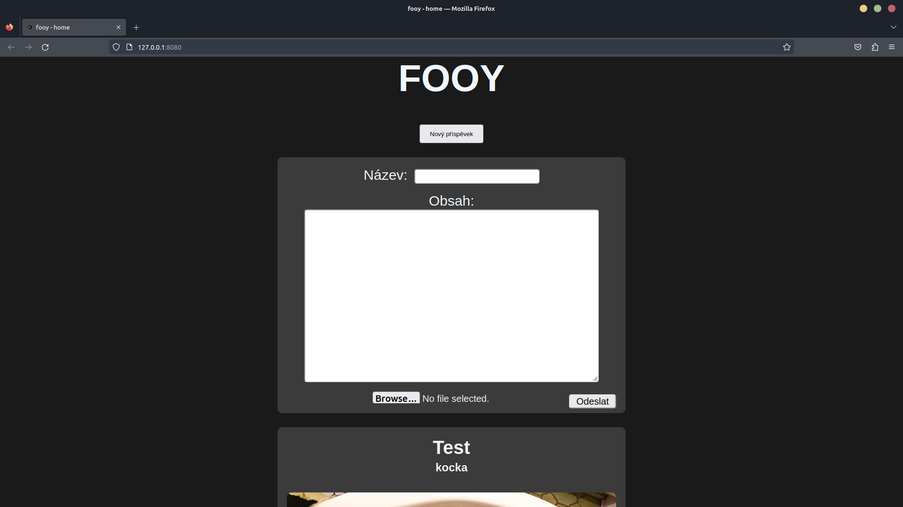

# FOOY

Fooy je jednoduhá template sociální síť v pythonu


# build
Jak hostovat vlastní verzi fooy? (linux)
```bash
git clone https://github.com/vskpsk/fooy && cd fooy
```
Spouštění serveru
```bash
python main.py
```
nadále se můžeme připojit na localhost port 8080

# Filesystem
users.json - ukládá všechny zaregistrovaná jména

posts.json - ukládá všechny posty

/src/static/uploads/ -  zde jsou všechny nahrané fotky




## License

[MIT](https://choosealicense.com/licenses/mit/)